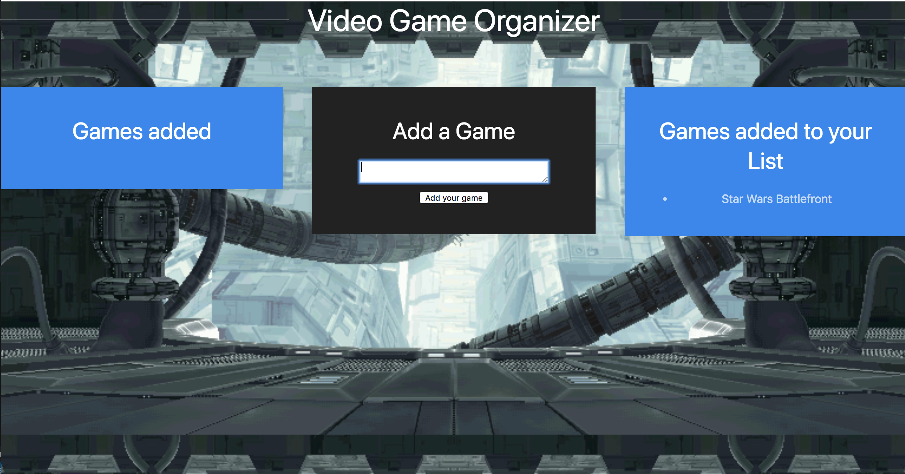

# Game Organizer

This program allows the user especially gamers to store which videos games they would like to add to their list. The user can add the game and then decide if they want to it to be a part of their list.

[Game Organizer](https://boiling-brushlands-16591.herokuapp.com/)

[Portfolio](https://mawais54013.github.io/New-Portfolio/)

# Images



This is a pic of the website deployed from Heroku and also includes various games I included but more can be added with just a keyboard away.


# Technology Used
- Express.js
- Javascript
- JQuery
- MYSQL2
- Node.js
- Heroku
- Sequelize
- Handlebars.js

# Code Snippets
1) The following code snippet is used to add a new game to the list. Instead of using the ORM this does it directly which is easier and saves time along with space that would originally be used in ORM. 
```
router.post("/", function(req, res) {
  var newBurger = req.body.game_name;
  console.log(newBurger + "============");
  model.burger.create({
    game_name: newBurger,
    bad: 0
  })
  .then(function () {
    res.redirect("/");
  });
});
```
2) The next code sets the variables in the database and exports them so they can used in both the controller and the handlebars. I give it two values just like the original version using ORM is the name and the boolean option of true or false. The boolean is key to change the game from the added list to the user's own list. 
```
'use strict';
module.exports = function(sequelize, DataTypes) {
  var burger = sequelize.define('burger', {
  game_name: DataTypes.STRING,
  bad: DataTypes.BOOLEAN
  });
  return burger;
};
```

# Author 
[Muhammad Awais](https://mawais54013.github.io/New-Portfolio/)
