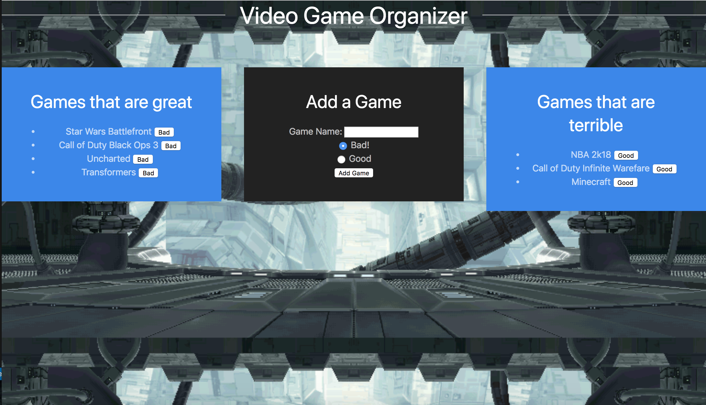

# Game Organizer

This program allows the user especially gamers to store which videos they like over others. The user can add games and select whether they are good or bad. Then later if they choose, the user can change the video games if they find it better than expected. Other than that enjoy gaming!!!!

[Game Organizer](http://localhost:3000/)

[Portfolio](https://mawais54013.github.io/New-Portfolio/)

# Images



This is a pic of the website deployed from Heroku and also includes various games I included but more can be added with just a keyboard away.


# Technology Used
- Handlebars.js
- Express.js
- Javascript
- JQuery
- MYSQL
- Node.js
- ORM middleware
- Heroku

# Code Snippets
1) The following code snippet is a middleware I used called ORM, this allows the program to take functions and receive data from the database to response back. In this case, this code is selecting all information from the database and using a callback function to return it. 
```
var orm = {
    selectAll: function(tableInput, cb)
    {
    var queryString = "SELECT * FROM " + tableInput + ";";
    connection.query(queryString, function(err, result)
    {
        if(err)
        {
            throw err;
        }
        cb(result);
    });
    },
}
```
2) The next code is used to make a ajax call to perform a function. In this case, I take the information the user inputted as a variable object with two keys to transfer to /api/burgers to POST them to the database and later in the code to give them attributes and show them on the DOM. 
```
$(".create-form").on("submit", function(event) {
event.preventDefault();
var newGame = {
    name: $("#gameName").val().trim(),

    // two values provided 
    bad: $("[name=bad]:checked").val().trim()
};
$.ajax("/api/burgers", {
    type: "POST",
    data: newGame
}).then(function()
{
    console.log("adding a new game");
    location.reload();
})

});
```

# Author 
[Muhammad Awais](https://mawais54013.github.io/New-Portfolio/)
